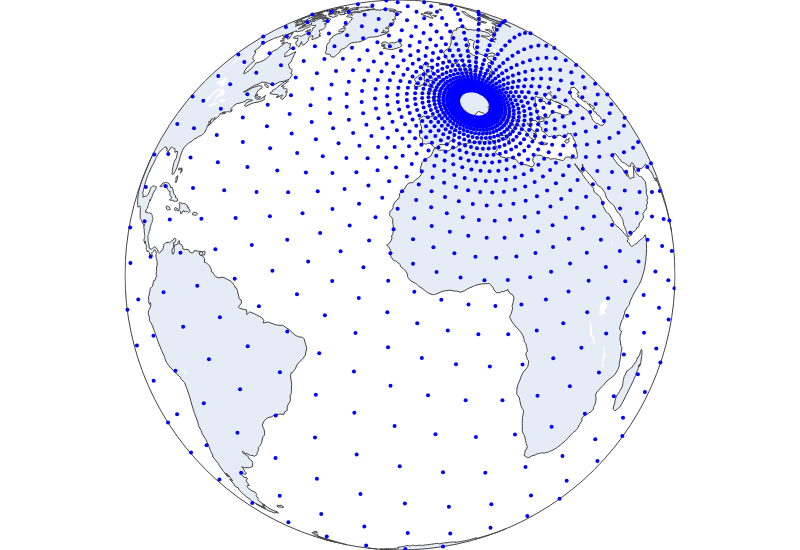

#################
 Concentric Grid
#################

This class allows us to define nodes based on multiple concentric
circles. This method generates multiple circles, in each circle the
nodes are equidistant from a specified central point. The circles are
created specifing a central point and the number of circles to generate.
Additionally the circles will be spaced using a geometrical distribution
starting from a chosen base distance from the center. The number of
points per circle can be scaled by setting the number of nodes on the
first circle and the number of nodes on the last circle.

To define the `node coordinates` based on a concentric grid, you can use
the following YAML configurations:

***************
 Global graphs
***************

The class `ConcentricNodes` allows us to define the nodes over the
entire globe

.. code:: yaml

   nodes:
     hidden: # name of the nodes
       node_builder:
         _target_: anemoi.graphs.nodes.ConcentricNodes
         center_coords: (22, 45)
         n_circles: 10
         base_dist: 0.1
         min_n_points: 64
         max_n_points: 1024
       attributes: ...

where: - `center_coords` is a tuple containing the lat, lon coordinates
of the central point. - `n_circles` is the total number of circles. -
`base_dist` is the radius of the first circle. - `min_n_points` is the
number of points on the first circle. - `max_n_points` is the number of
points on the last circle.

*****************
 Stretched Graph
*****************

The class `StretchedConcentricNodes` allows us to define concentric
nodes around the center of a lam region with a specific icosahedral
resolution.

.. code:: yaml

   nodes:
     hidden: # name of the nodes
       node_builder:
        _target_: anemoi.graphs.nodes.StretchedConcentricNodes
        lam_resolution: 10
        n_circles: 256
        base_dist: 50
        min_n_points: 64
        max_n_points: 256
        reference_node_name: ${graph.data}
        mask_attr_name: cutout
        margin_radius_km: 11
       attributes: ...

where: - `lam_resolution` is are the number of refinements to be applied
to the icosahedron inside the area of interest. - `center_coords` is a
tuple containing the lat, lon coordinates of the central point. -
`n_circles` is the total number of circles. - `base_dist` is the radius
of the first circle. - `min_n_points` is the number of points on the
first circle. - `max_n_points` is the number of points on the last
circle.

.. warning::

   This class will require the `trimesh <https://trimesh.org>`_ package
   to be installed. You can install it with `pip install trimesh`.
