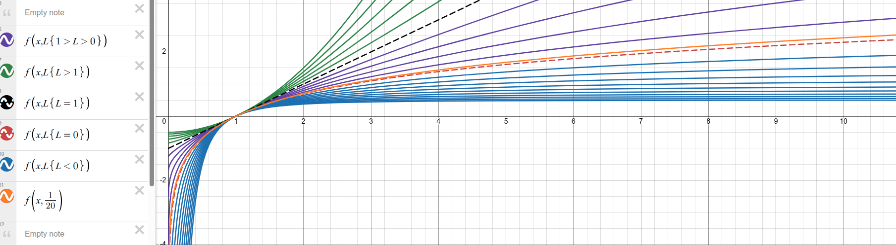
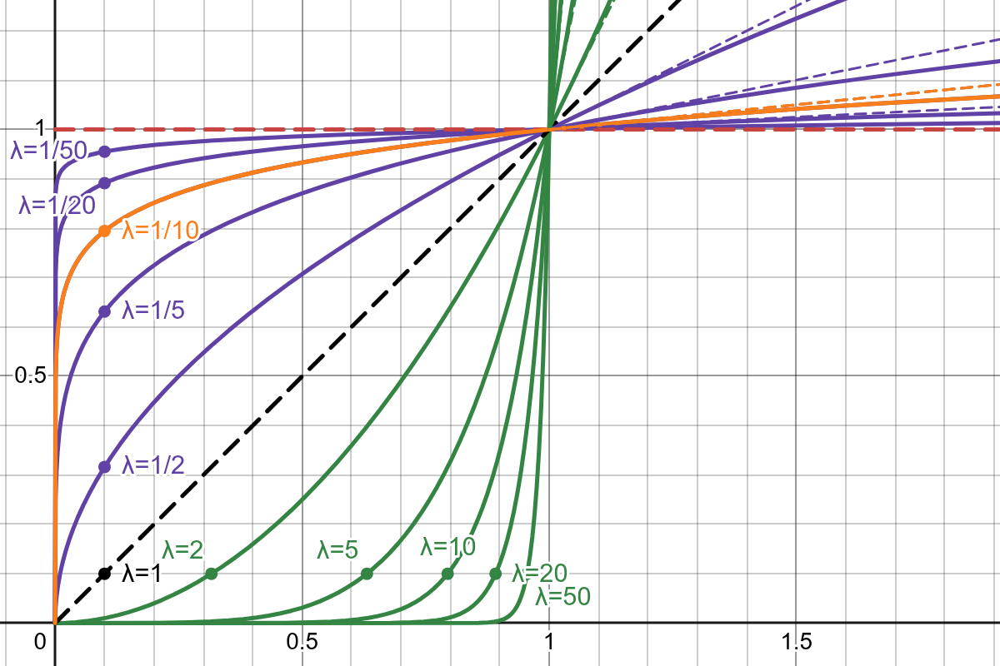
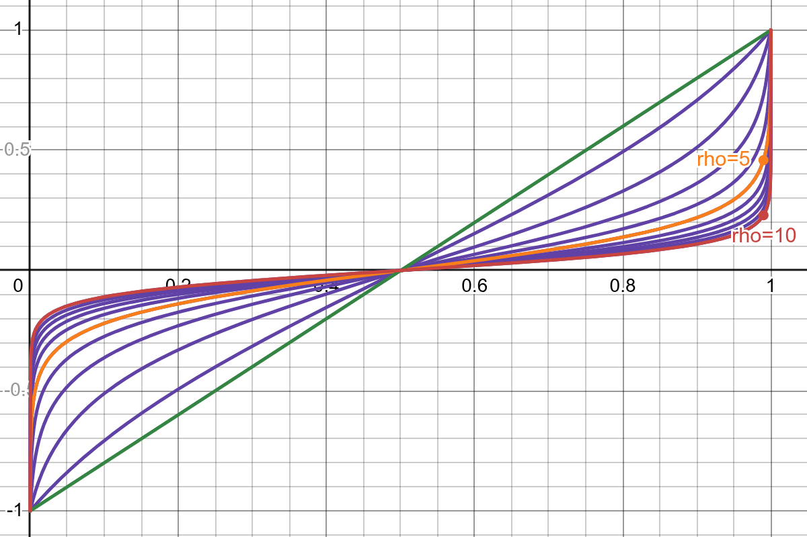

###############
 Preprocessing
###############

The preprocessing module is used to pre- and post-process the data.
Preprocessors are applied to the input data before it is passed to the
model, and postprocessors are applied to the output data after it has
been produced by the model and (in training) after the training loss has
been calculated. The module contains the following classes:

.. automodule:: anemoi.models.preprocessing
   :members:
   :no-undoc-members:
   :show-inheritance:

************
 Normalizer
************

The normalizer module is used to normalize the data. The module contains
the following classes:

.. automodule:: anemoi.models.preprocessing.normalizer
   :members:
   :no-undoc-members:
   :show-inheritance:

**********
Remapper
**********

The remapper module is used to do online transformations of the data using a set of predefined transforms and their inverses. This process is crucial for variables with pathological distributions, such as variables with a sharp peaks, long tails or other non-Gaussian shapes. It is especially important for diffusion models where the data distribution interacts with the noise distribution.

.. note::
   The remapper module enables only single-variable transformations.
   Multi-variable transformations (such as ``(ws wdir) -> (u v)``) are
   not supported for memory reasons and must be performed at the level
   of the datasets.

The remapper module supports the following transformations:

- ``none`` (no transformation)
- ``affine`` (x -> scale * x + shift)
- ``log1p`` (log(1+x))
- ``sqrt``
- ``boxcox`` ((x^lambd - 1) / lambd) or (log(x) if lambd == 0)
- ``power`` (x^lambd) `wiki`_
- ``atanh`` (atanh(rho * (2x - 1)) / rho)
- ``asinh`` (asinh(x))
- ``displace_boundary_atoms`` (shifts precise boundary peaks away from other
  values to give the model a non-zero width bucket to model them)

.. _wiki: https://en.wikipedia.org/wiki/Power_transform#Box%E2%80%93Cox_transformation

Several remappers can be applied one after the other in a chain. The order of the remappers is important, as the output of one remapper is the input to the next remapper. Remappers must be applied after the normalizer as normalizer relies on the computed statistics of the dataset.

Example tranform functions:

   Box-cox remapper transform function examples with λ = [-2, -1.8, … , 2]. Negative λ is blue, λ=0 red, 0<λ<1 purple, λ=1=linear dashed black, and λ>1 green. Input Values must be positive.

   Power remapper transform function examples.

   Atanh remapper transform function examples.

Example configuration:

.. code:: yaml
   data:
      processors:
         normalizer:
           _target_: anemoi.models.preprocessing.multi_dataset_normalizer.TopNormalizer
           _convert_: all
           config:
             default: "mean-std"
             max: ["tp","tcc"]
         remapper1:
           _target_: anemoi.models.preprocessing.remapper.Remapper
           _convert_: all
           config:
             power: ["tp"]
             atanh: ["tcc"]
             method_kwargs:
               power:
                 lambd: 0.1
                 tangent_linear_above_one: true
               atanh:
                 rho: 3.0
         remapper2:
           _target_: anemoi.models.preprocessing.remapper.Remapper
           _convert_: all
           config:
             affine: ["tp"]
             displace_boundary_atoms: ["tcc"]
             method_kwargs:
               affine:
                 scale: 2.0
               displace_boundary_atoms:
                 lower_atom: -1.0
                 lower_target: -1.5
                 upper_atom: 1.0
                 upper_target: 1.5
                 eps: 1e-4
         remapper3:
           _target_: anemoi.models.preprocessing.remapper.Remapper
           _convert_: all
           config:
             displace_boundary_atoms: ["tp"]
             method_kwargs:
               displace_boundary_atoms:
                 lower_atom: 0
                 lower_target: -1
                 eps: 1e-7

The module contains the following classes:

.. automodule:: anemoi.models.preprocessing.remapper
   :members:
   :no-undoc-members:
   :show-inheritance:

*********
 Imputer
*********

Machine learning models cannot process **missing values (NaNs)**
directly, so missing values in input data and the target must be handled
before being handled by the model. The **Imputer** module in
anemoi-models handles missing values (NaNs) before the data is input to
the model and after the model's output is handled by the training loss.

For each input batch, the module identifies NaN locations and replaces
the NaNs with a configured imputation value, as specified in the
configuration file. If a variable is present in the output data, the
imputed values are restored to NaN at the original NaN locations from
the first timestep of the input.

The imputer provides the nan mask as a **loss scaler**
``anemoi.training.losses.scalers.loss_weights_mask.NaNMaskScaler`` to
the loss function, if the scaler is included in
``config.training.training_loss``. Then the training loss function uses
the nan mask to ignore the imputed values in the loss calculation. This
mask is updated for every batch during training.

During training, diagnostic variables are included in each batch, and
therefore at the input timesteps. Any NaNs in the target data are
weighted by zero to enable proper loss computation. During inference,
however, NaN locations for diagnostic variables are not available (those
fields aren not part of the model input) so the imputer cannot
reintroduces NaNs into the diagnostic output. To insert NaNs into
diagnostic variables, the postprocessor
``anemoi.models.preprocessing.postprocessor.ConditionalNaNPostprocessor``
has to be used. This masks diagnostic variable entries by setting them
to NaN wherever the chosen (prognostic) masking variable is NaN.

The dynamic imputers are used to impute NaNs in the input data and do
not replace the imputed values with NaNs in the output data. Therefore,
the nan mask is not provided as a scaler to the loss function either.

The module contains the following classes:

.. automodule:: anemoi.models.preprocessing.imputer
   :members:
   :no-undoc-members:
   :show-inheritance:
