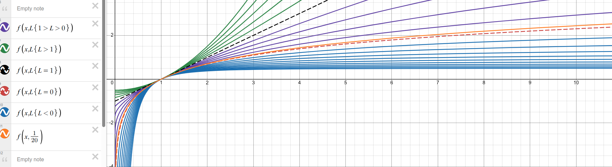
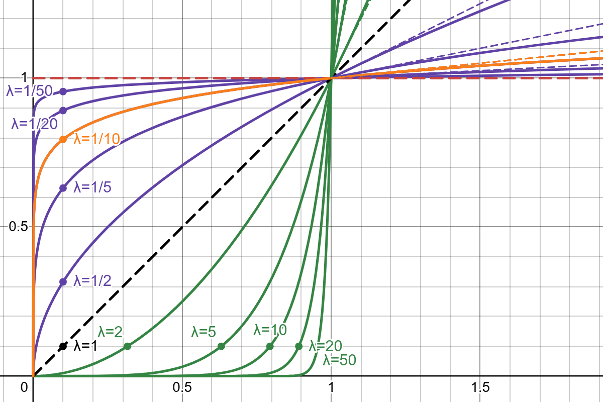
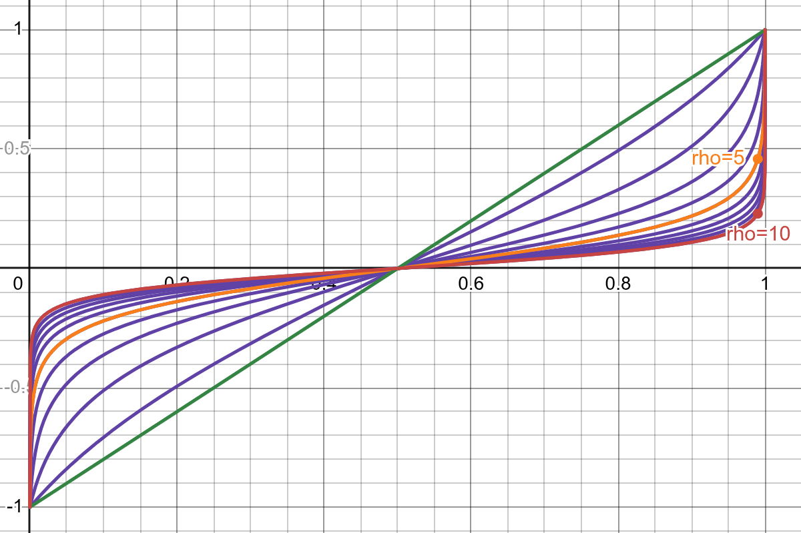

###############
 Preprocessing
###############

The preprocessing module is used to pre- and post-process the data.
Preprocessors are applied to the input data before it is passed to the
model, and postprocessors are applied to the output data after it has
been produced by the model and (in training) after the training loss has
been calculated. The module contains the following classes:

.. automodule:: anemoi.models.preprocessing
   :members:
   :no-undoc-members:
   :show-inheritance:

************
 Normalizer
************

The normalizer module is used to normalize the data. The module contains
the following classes:

.. automodule:: anemoi.models.preprocessing.normalizer
   :members:
   :no-undoc-members:
   :show-inheritance:

**********
Remapper
**********

The remapper module is used to do in-place transformations of the data using a set of predefined transforms and their inverses. This process is crucial for variables with pathological distributions, such as variables with sharp peaks, long tails or other non-Gaussian shapes. It is especially important for diffusion models where the data distribution interacts with the noise distribution.

.. note::
   The remapper module enables only single-variable transformations.
   Multi-variable transformations (such as ``(ws wdir) -> (u v)``) are
   not supported for memory reasons and must be performed at the level
   of the datasets.

The remapper module supports the following transformations:

- ``none`` (no transformation)
- ``affine`` (x -> scale * x + shift)
- ``log1p`` (log(1+x))
- ``sqrt``
- ``boxcox`` ((x^lambd - 1) / lambd) or (log(x) if lambd == 0)  `wiki`_
- ``power`` (x^lambd)
- ``atanh`` (atanh(rho * (2x - 1)) / rho)
- ``asinh`` (asinh(x))
- ``displace_boundary_atoms`` (shifts precise boundary peaks away from other
  values to give the model a non-zero width bucket to model them)

.. _wiki: https://en.wikipedia.org/wiki/Power_transform#Box%E2%80%93Cox_transformation

Several remappers can be applied one after the other in a chain. The order of the remappers is important, as the output of one remapper is the input to the next remapper. Remappers must be applied after the normalizer as normalizer relies on the computed statistics of the dataset.

Example tranform functions:

   Box-cox remapper transform function examples with λ = [-2, -1.8, … , 2]. Negative λ is blue, λ=0 red, 0<λ<1 purple, λ=1=linear dashed black, and λ>1 green. Input Values must be positive.

   Power remapper transform function examples.

   Atanh remapper transform function examples.

Example configuration:

.. code:: yaml

   data:
      processors:
         normalizer:
           _target_: anemoi.models.preprocessing.normalizer.InputNormalizer
           config:
             default: "mean-std"
             max: ["tp","tcc"]
         remapper1:
           _target_: anemoi.models.preprocessing.remapper.Remapper
           config:
             power: ["tp"]
             atanh: ["tcc"]
             method_kwargs:
               power:
                 lambd: 0.1
                 tangent_linear_above_one: true
               atanh:
                 rho: 3.0
         remapper2:
           _target_: anemoi.models.preprocessing.remapper.Remapper
           config:
             affine: ["tp"]
             displace_boundary_atoms: ["tcc"]
             method_kwargs:
               affine:
                 scale: 2.0
               displace_boundary_atoms:
                 lower_atom: -1.0
                 lower_target: -1.5
                 upper_atom: 1.0
                 upper_target: 1.5
                 eps: 1e-4
         remapper3:
           _target_: anemoi.models.preprocessing.remapper.Remapper
           config:
             displace_boundary_atoms: ["tp"]
             method_kwargs:
               displace_boundary_atoms:
                 lower_atom: 0
                 lower_target: -1
                 eps: 1e-7

The module contains the following classes and functions:

.. automodule:: anemoi.models.preprocessing.remapper
   :members:
   :no-undoc-members:
   :show-inheritance:

.. automodule:: anemoi.models.preprocessing.mappings
   :members:
   :no-undoc-members:
   :show-inheritance:

*********
 Imputer
*********

Machine learning models cannot process **missing values (NaNs)**
directly. The **Imputer** module in anemoi-models replaces NaNs in model
inputs with a configured finite value. Missing values in training
targets remain represented as NaNs and are handled by the loss.

Set ``ignore_nans: true`` on a loss that is expected to receive missing
targets. The loss then zero-masks both the target and the corresponding
prediction before calculating the error. Losses whose data contract
requires finite targets should leave ``ignore_nans`` disabled so an
unexpected NaN remains visible.

During inference, NaN locations for diagnostic variables may not be
available because those fields are not part of the model input. To
insert NaNs into diagnostic variables, the postprocessor
``anemoi.models.preprocessing.postprocessor.ConditionalNaNPostprocessor``
has to be used. This masks diagnostic variable entries by setting them
to NaN wherever the chosen (prognostic) masking variable is NaN.

The module contains the following classes:

.. automodule:: anemoi.models.preprocessing.imputer
   :members:
   :no-undoc-members:
   :show-inheritance:
