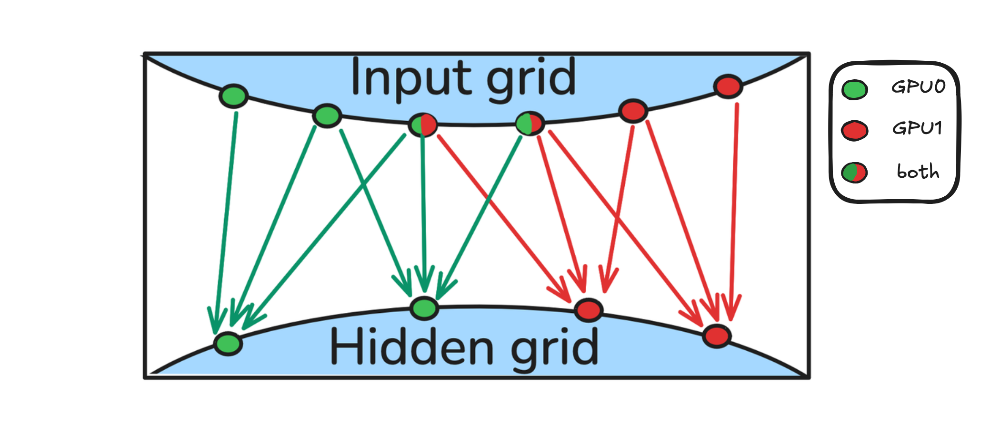
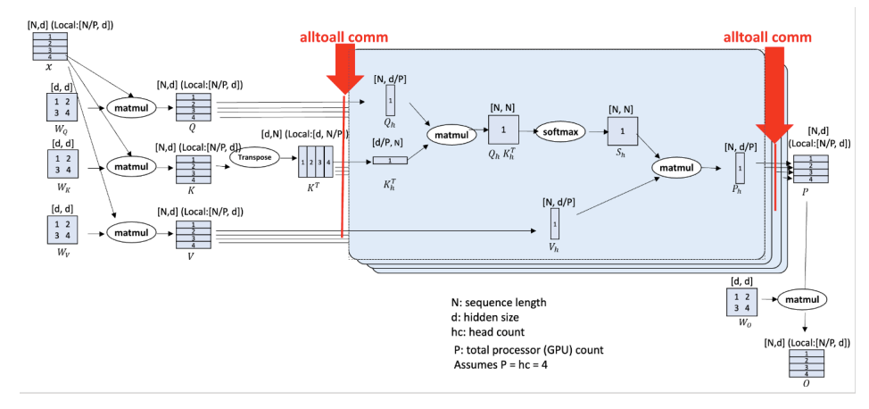

#################
 Parallelisation
#################

There are two types of parallelisation which users can use in
anemoi-training:

#. Data Distributed
#. Model Sharding

These can either be used individually or both at the same time.

******************
 Data-Distributed
******************

This is used automatically if the ``number of parallel data GPUs = number
of GPUs available/number of GPUs per model`` is an integer greater than
1. In this case the batches will be split across the number of parallel
data GPUs meaning that the effective batch size of each training step
will be the number of batches set in the dataloader config file
multiplied by the number of parallel data GPUs.

****************
 Model Sharding
****************

It is also possible to shard a single model across multiple GPUs.
To use model sharding, set ``config.system.hardware.num_gpus_per_model``
to the number of GPUs you wish to shard the model across. Set
``config.model.keep_batch_sharded=True`` to also keep batches fully
sharded throughout training and dataloading, reducing memory usage for
large inputs or long rollouts.

Note that model sharding comes with communication overhead, so it is
recommended to first maximise data parallelism before sharding the
model.

When using model sharding, the global grid is partitioned across GPUs:
each GPU owns a contiguous sub-region of the globe. For GNN-based layers
(including the GraphTransformer), the edges are split accordingly: each
GPU only stores and computes edges whose destination node belongs to its
partition. To allow information to flow across partition boundaries,
nodes from neighbouring partitions that are sources of cross-partition
edges are exchanged as *halo* nodes before each layer's message passing,
and discarded afterwards. This is illustrated below.

   Graph partitioning across two GPUs. Each colour represents one
   partition (inner nodes). Halo nodes received from the neighbouring
   partition are shown in red/green along the partition boundary.

This *edge sharding* strategy is enabled by default for the GraphTransformer:

.. code:: yaml

   model:
     encoder:
       shard_strategy: edges
     processor:
       shard_strategy: edges
     decoder:
       shard_strategy: edges

Dense attention layers without a sparse graph (e.g. the sliding-window
processor) instead shard the attention heads across GPUs, as shown in
the figure below. This requires expensive all-to-all communication
as opposed to the more local point-to-point communication used in edge sharding.
Head sharding can also be selected for the GraphTransformer:

.. code:: yaml

   model:
     encoder:
       shard_strategy: heads
     processor:
       shard_strategy: heads
     decoder:
       shard_strategy: heads

This may be beneficial when the graph is very densely connected, but
note that head sharding requires an all-to-all communication at every
layer and quickly becomes the communication bottleneck. It is therefore
most suitable for layers where attention is already close to dense (e.g.
sliding-window attention) rather than sparse GNN message passing.

   Head sharding (source: `Jacobs et al. (2023) <https://arxiv.org/pdf/2309.14509>`_)

Anemoi Training provides different sharding strategies depending if the
model task is deterministic or ensemble based.

For deterministic models, the ``DDPGroupStrategy`` is used:

.. code:: yaml

   strategy:
      _target_: anemoi.training.distributed.strategy.DDPGroupStrategy
      num_gpus_per_model: ${system.hardware.num_gpus_per_model}
      read_group_size: ${dataloader.read_group_size}

When using model sharding, ``config.dataloader.read_group_size`` allows
for sharded data loading in subgroups. This should be set to the number
of GPUs per model for optimal performance.

For ensemble models, the ``DDPEnsGroupStrategy`` is used which in
addition to sharding the model also distributes the ensemble members
across GPUs:

.. code:: yaml

   strategy:
     _target_: anemoi.training.distributed.strategy.DDPEnsGroupStrategy
     num_gpus_per_model: ${system.hardware.num_gpus_per_model}
     read_group_size: ${dataloader.read_group_size}

This requires setting ``config.system.hardware.num_gpus_per_ensemble``
to the number of GPUs you wish to parallelise the ensemble members
across and ``config.training.ensemble_size_per_device`` to the number of
ensemble members per GPU.

**********
 Examples
**********

Suppose the job is running on 8 nodes each with 4 GPUs and that
``config.system.hardware.num_gpus_per_model=2`` and
``config.dataloader.batch_size.training=1``. Then each model will be
sharded across 2 GPUs and the data sharded across ``total number of
GPUs/num_gpus_per_model=32/2=16``. This means the effective batch size
is 16.

Alternatively, with no model sharding on a single node with 4 GPUs, setting
``config.system.hardware.num_gpus_per_model=1`` and
``config.dataloader.batch_size.training=4`` gives 4-way data
parallelism on 4 GPUs, again yielding an effective batch size of 16.
