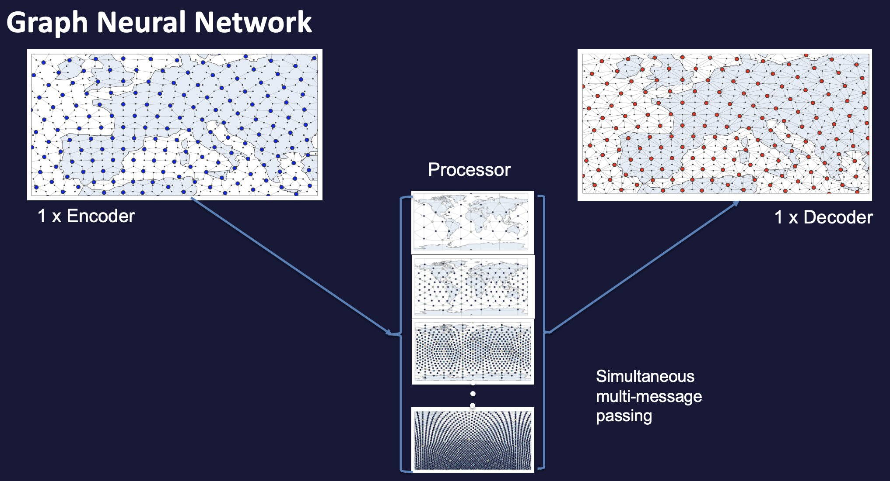

########
 Models
########

The user can pick between different model tasks and types when using
anemoi-training:

**Model Tasks:**

#. Deterministic Forecasting (GraphForecaster)
#. Ensemble Forecasting (GraphEnsForecaster)
#. Time Interpolation (GraphMultiOutInterpolator)
#. Diffusion-based Forecasting (GraphDiffusionForecaster)

The model tasks specify the training objective and are specified in the
configuration through ``training.model_task``. They are our
`LightningModules <https://lightning.ai/docs/pytorch/lightning.html>`_.

**Model Types:**

#. Graph Neural Network (GNN)
#. Graph Transformer Neural Network
#. Transformer Neural Network
#. Point-wise Multilayer Perceptron

The model types specify the model architecture and can be chosen
independently of the model task. Currently, all models have a
Encoder-Processor-Decoder structure, with physical data being encoded on
to a latent space where the processing takes place.

For a more detailed read on connections in Graph Neural Networks,
`Velickovic (2023) <https://arxiv.org/pdf/2301.08210>`_ is recommended.

For detailed instructions on creating models, see the
:ref:`anemoi-models:usage-create-model`.

.. note::

   Currently, the GNN model type is not supported with the Ensemble
   Forecasting model task and the Diffusion Forecasting model task.

************
 Processors
************

The processor is the part of the model that performs the computation on
the latent space. The processor can be chosen to be a GNN,
GraphTransformer, Transformer with Flash attention or Point-wise MLP.

GNN
===

The GNN structure is similar to that used in Keisler (2022) and Lam et
al. (2023).

The physical data is encoded on to a multi-mesh latent space of
decreasing resolution. This multi-mesh is defined by the graph given in
``config.system.input.graph``.

   GNN structure

On the processor grid, information passes between the node embeddings
via simultaneous multi-message-passing. The messages received from
neighboring nodes are a function of their embeddings from the previous
layer and are aggregated by summing over the messages received from
neighbours. The data is then decoded by the decoder back to a single
resolution grid.

Graph Transformer
=================

The GraphTransformer uses convolutional multi-message passing on the
processor. In this case, instead of the messages from neighbouring nodes
being weighted equally (as in the case for GNNs), the GNN can learn
which node embeddings are important and selectively weight those more
through learning the `attention weight` to give to each embedding.

Note that here, the processor grid is a single resolution which is
coarser than the resolution of the base data.

Transformer
===========

The Transformer uses a multi-head self attention on the processor. Note
that this requires `flash-attention
<https://github.com/Dao-AILab/flash-attention>`__ to be installed.

The attention windows are chosen in such a way that a complete grid
neighbourhood is always included (see Figure below). Like with the
GraphTransformer, the processor grid is a single resolution which is
coarser than the resolution of the base data.

   Attention windows (grid points highlighted in blue) for different grid points (red).

.. note::

   The Transformer does not require a subgraph.

Point-wise MLP
==============

The Point-wise MLP applies the same multilayer perceptron independently
to each node. Results for each node are not conditioned on other nodes,
as there is no message passing or interaction between nodes.

.. note::

   The Point-wise MLP does not require a subgraph.

*******************
 Encoders/Decoders
*******************

The encoders and decoders can be chosen to be GNNs, GraphTransformers,
or Transformers. This choice is independent of the processor, but
currently the encoders and decoders must be the same model type otherwise
the code will break.

*******************
 Switchable Layers
*******************

Layer kernels provide a flexible mechanism to customize the
implementation of linear layers and layer normalization in different
parts of the model (encoder, processor, decoder) through the
``config.yaml``.

This allows you to switch out the default layers with alternative
implementations, such as different activation functions or normalization
techniques, without modifying the underlying model code. This is done by
specifying the desired layer implementations in the configuration file
under the ``layer_kernels`` section.

For detailed information and examples, see
:ref:`anemoi-models:layer-kernels`.

.. _usage-field_truncation:

******************
 Field Truncation
******************

Field truncation is a pre-processing step applied during autoregressive
rollout. It smooths the skipped connection data which helps maintain
stability during rollout and can be used for multi-scale loss
computation.

**********
 Overview
**********

Truncation matrices are sparse transformation matrices that filter
high-frequency components from the input data. This process serves two
main purposes:

#. **Stability Enhancement**: Smoothing the skipped connection data
   helps maintain numerical stability during long autoregressive
   rollouts by reducing noise amplification.

#. **Multi-scale Loss Computation**: For ensemble training, truncation
   matrices can be used to compute losses at different scales.

.. note::

   Truncation matrices can be generated using the ``anemoi-graphs``
   package, or constructed at runtime (on-the-fly mode). For detailed
   instructions on how to create these matrices, see
   :ref:`Create sparse matrices with anemoi-graphs
   <anemoi-graphs:usage-create_sparse_matrices>`.

**********************
 TruncatedConnection
**********************

:class:`anemoi.models.layers.residual.TruncatedConnection` applies a
coarse-graining and reconstruction step to the skip-connection features.
It is configured via a single ``truncation_config`` key that supports
two modes.

**On-the-fly mode** — build the projection graph at startup from a
coarser grid:

.. code:: yaml

   model:
     residual:
       _target_: anemoi.models.layers.residual.TruncatedConnection
       truncation_config:
         grid: o32
         num_nearest_neighbours: 3
         sigma: 1.0

**File-based mode** — load pre-computed sparse matrices from disk:

.. code:: yaml

   model:
     residual:
       _target_: anemoi.models.layers.residual.TruncatedConnection
       truncation_config:
         truncation_down_file_path: /path/to/truncation_down.npz
         truncation_up_file_path: /path/to/truncation_up.npz

.. _multiscale-loss-userguide:

**********************
 Multiscale Loss
**********************

The ``MultiscaleLossWrapper`` implements the multiscale loss formulation
presented in <https://arxiv.org/abs/2506.10868>. It wraps around loss
functions such as the ``AlmostFairKernelCRPSLoss`` to provide
scale-aware model training.

The wrapper is configured via a single ``multiscale_config`` key that
supports two modes.

**On-the-fly mode** — build smoothing graphs at startup from a
geometric progression of KNN smoothers:

.. code:: yaml

   training:
     training_loss:
       datasets:
         your_dataset_name:
           _target_: anemoi.training.losses.MultiscaleLossWrapper
           weights: [0.5, 0.25, 0.15, 0.1]
           keep_batch_sharded: false
           multiscale_config:
             num_scales: 3          # builds 3 smoothed + 1 full-res = 4 scales
             base_num_nearest_neighbours: 4
             base_sigma: 0.1
             scale_factor: 2
           per_scale_loss:
             _target_: anemoi.training.losses.kcrps.AlmostFairKernelCRPS
             scalers: ['node_weights']

**File-based mode** — load pre-computed sparse matrices from disk:

.. code:: yaml

   training:
     training_loss:
       datasets:
         your_dataset_name:
           _target_: anemoi.training.losses.MultiscaleLossWrapper
           weights: [0.5, 0.25, 0.15, 0.1]
           keep_batch_sharded: false
           multiscale_config:
             loss_matrices_path: /path/to/matrices
             loss_matrices:
               - filter_8x.npz   # coarsest scale
               - filter_4x.npz
               - filter_2x.npz
               - null            # full resolution
           per_scale_loss:
             _target_: anemoi.training.losses.kcrps.AlmostFairKernelCRPS
             scalers: ['node_weights']

The loss at each scale is computed on the *residual* between successive
smoothing levels, so that each scale captures the energy in its
frequency band. Scales must be ordered coarsest-first; the final
``null`` entry always applies no smoothing (full resolution).

The number of entries in ``weights`` must equal the total number of
scales (smoothed + full-res).

***************
 Ensemble Size
***************

For ensemble forecasting tasks (:class:`GraphEnsForecaster`), the number
of ensemble members used during training is specified in the
configuration:

.. code:: yaml

   training:
      ensemble_size_per_device: 4

This determines how many ensemble members are generated per device
during training. Effective ensemble size is then the number of ensemble
members per device times the number of GPUs per ensemble.

*************
 Compilation
*************

PyTorch supports JIT-compiliation of code. This can speed up execution
and reduce peak memory usage. For more information, consult `the
introduction to torch.compile
<https://docs.pytorch.org/tutorials/intermediate/torch_compile_tutorial.html>`__
and `the official documentation
<https://docs.pytorch.org/docs/stable/generated/torch.compile.html>`__.

Compilation requires Triton. Normally Triton is pulled in as a
dependancy when PyTorch is installed. Otherwise, Triton can be `built
from source
<https://github.com/triton-lang/triton?tab=readme-ov-file#install-from-source>`__
. Compilation requires torch >= 2.6 and torch_geometric >= 2.6. If these
versions are not met, or if Triton is not installed, then anemoi will
run without compilation.

Anemoi exposes 'torch.compile' at the module level through the model
config. Below is an example:

.. code:: yaml

   #training/config/models/transformer_ens.yaml
   compile:
   - module: anemoi.models.layers.conv.GraphTransformerConv
     options:
       dynamic: false
       mode: max-autotune
   - module: anemoi.models.layers.normalization.ConditionalLayerNorm
     options:
       dynamic: false

Under the 'compile' keyword, you provide a list of modules. These
modules will be marked for compilation when the model is built. During
their first forward pass, these modules will be compiled. No code
modifications are required.

You can optionally pass options to torch compile via the 'options'
keyword. A full list of the possible options and their meanings can be
found in the `torch.compile documentation
<https://docs.pytorch.org/docs/stable/generated/torch.compile.html>`__.
